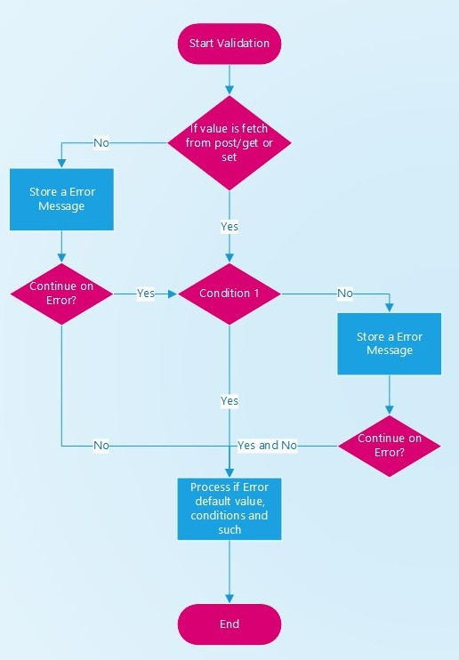

# ValidationOne
It's a PHP library for fetchs and validate fields and store messages in different containers(including error, warning, info
, and success) depending on the conditions.

The ideology behind this library is simple: 5 classes, no dependencies and runs in PHP 5.6 and higher, so it could run
in practically any PHP project, including Wordpress, Laravel, a custom PHP project, etc. 

[](https://travis-ci.org/EFTEC/ValidationOne)
[](https://packagist.org/packages/eftec/ValidationOne)
[](https://packagist.org/packages/eftec/ValidationOne)
[]()
[]()
[]()
[]()
[]()
[]()

## Examples

[Examples](https://github.com/EFTEC/ValidationOne/tree/master/examples)

[Tutorial Form and Table with PHP](https://github.com/EFTEC/BladeOne-tutorial1)

  
It is an example of functionality.  A normal example is more complex, even if it's only a few lines of code.


## ValidationOne

Let's say we want to validate a value an input value (get) called "id", we could do the next things:

* the default value is the text "**ERROR**"
* the type of the value is an **integer**, so it must returns an integer.   It also could be an integer,decimal,string,date,datestring and boolean
* we add a condition, the value must be equals (**eq**) to **10**. If fails then it returns a message (as **error**)
* we add another condition, if the value must be equals (**eq**) to **30**. If fails then it returns an **info** (not an error)
* If the operation fails then it returns the default value.
* And finally, we obtain the "**id**" from $_GET (parameter url).

```php
use eftec\ValidationOne;
$val=new ValidationOne();

$r = $val->def('ERROR')
    ->type('integer')
    ->ifMissingThenDefault()
    ->condition("eq", "It's not equals to 10", 10)
    ->condition("eq", "It's not equals to 30 (info)", 30, 'info')
    ->ifFailThenDefault()
    ->get('id'); // <-- end of the chain
```

But, where is the error?.  The messages are stored in **messagelist**

```php
var_dump($val->messageList->allArray()); // here we show all messages of any kind of type. 
var_dump($val->messageList->errorcount); // returns the number of errors.
```
However, we could also show a message by type (error, warning..) and only message by a specific identifier.

```php
var_dump($val->messageList->get('id')->allErrorOrWarning()); // All error or warning contained in the key "id".
```

Why the messages are store in some structure?. Is it not easy to simply return the error?   .

The answer is a form. Le't say we have a form with 3 fields. If one of them fails, then 
the error must be visible for each field separately.  Also, the whole form could have it's own message.

### condition ($condition, $message = "", $conditionValue = null, $level = 'error', $key = null)

It adds a condition that it depends on the **type** of the input.

* @param string $condition

	<b>number</b>:req,eq,ne,gt,lt,gte,lte,between,null,notnull<br>
	<b>string</b>:req,eq,ne,minlen,maxlen,betweenlen,null,notnull,contain,notcontain
	,alpha,alphanum,text,regexp,email,url,domain<br>
	<b>date</b>:req,eq,ne,gt,lt,gte,lte,between<br>
	<b>datestring</b>:req,eq,ne,gt,lt,gte,lte,between<br>
	<b>boolean</b>:req,eq,ne,true,false<br>
	<b>file</b>:minsize,maxsize,req,image,doc,compression,architecture,ext<br>
	<b>function:</b><br>
	fn.static.Class.methodstatic<br>
	fn.global.function<br>
	fn.object.Class.method where object is a global $object<br>
	fn.class.Class.method<br>
	fn.class.\namespace\Class.method<br>
	
* @param string $message  

    Message could use the next variables '%field','%realfield','%value','%comp','%first','%second'  

    | Field      | Description                                                  | Example             |
    | ---------- | ------------------------------------------------------------ | ------------------- |
    | %field     | name of the field, it could be the  friendid or the actual name | CustomerID          |
    | %realfield | name of the field (not the  friendid)                        | Customer Identifier |
    | %value     | current value of the field                                   | John                |
    | %comp      | value to compare (if any)                                    |                     |
    | %first     | first value to compare (if the compare value  is an array)   |                     |
    | %second    | second value to compare (if the compare  value is an array)  |                     |
    | %key       | key used (for input array)                                   |                     |

* @param null $conditionValue

* @param string $level (error,warning,info,success)

* @param string $key If key is not null then it is used for add more than one condition by key

* @return ValidationOne

> Note: if the value is null and isNullValid() is true, then the conditions are ignored.
> If the value is missing and isMissingValid() is true, then the conditions are ignored.
> If the value is empty ('') and isEmptyValid() is true, then the conditions are ignored.
> If the value is empty ('') or null and isNullOrEmptyValid() is true, then the conditions are ignored.
> isNullValid(),isMissingValid(),isNullOrEmptyValid() and isEmptyValid() are useful when we want to validate a value 
> only if it exists or if the value is set.

Example:

```php
$validation->def(null)
    ->type('integer')
    ->condition('eq','%field %value is not equal to %comp ',50)
    ->condition('eq','%field %value is not equal to %comp ',60)
    ->set('aaa','variable2');	
```

#### types

| type           | description                                                                                             |
|----------------|---------------------------------------------------------------------------------------------------------|
| integer        | (numeric) it allows a number without decimal                                                            |
| unixtime       | (numeric) it allows a number without decimal                                                            |
| boolean        | (boolean) it stores true or false. The input could vary (empty, zero or   null = false, otherwise true) |
| decimal        | (numeric) it allows a number with decimal                                                               |
| float          | (numeric) it allows a number with decimal                                                               |
| varchar        | (string) it allows any input                                                                            |
| string         | (string) it allows any input                                                                            |
| date           | (date) the input could be a DateTime or a string. The value is stored as   an object DateTime           |
| datetime       | (date) the input could be a DateTime or a string. The value is stored as   an object DateTime           |
| datestring     | (date) the input could be a DateTime or a string. The value is stored as   an string                    |
| datetimestring | (date) the input could be a DateTime or a string. The value is stored as   an string                    |
| file           | (file) the input is a string and it's store as an string but it adds an   special validations           |


#### Input type x Conditions allowed.

| Input type                                   | Condition                                                          |   |
|----------------------------------------------|--------------------------------------------------------------------|---|
| number                                       | gt,lt,gte,lte,between                                          |   |
| string                                       | minlen,maxlen,betweenlen,contain<br>,notcontain,alpha,alphanum,text,regexp,email,url,domain |   |
| date                                         | gt,lt,gte,lte,between                                          |   |
| datestring                                   | gt,lt,gte,lte,between                                          |   |
| boolean                                      | true,false                                                     |   |
| file                                         | minsize,maxsize,req,image,doc,compression,architecture,ext         |   |
| *  (it applies for any type)                 | req,eq,ne,null,notnull,empty,notempty                                  |   |
| *                                            | function                                                           |   |
| *                                            | fn.static.Class.methodstatic                                       |   |
| *                                            | fn.global.function                                                 |   |
| *                                            | fn.object.Class.method where object is a global $object            |   |
| *                                            | fn.class.Class.method                                              |   |
| *                                            | fn.class.\namespace\Class.method                                   |   |

#### Types of Conditions.

| Condition                                               | Description                                            | Value Example          |
|---------------------------------------------------------|--------------------------------------------------------|------------------------|
| architecture                                            | The extension of the file must be an architecture file |                        |
| between                                                 | The number must be between two values                  | [0,20]                 |
| betweenlen                                              | The lenght of the text must be between two values      | [0,20]                 |
| compression                                             | The extension of the file must be an compression file  |                        |
| contain                                                 | The text must contain a value                          | "text"                 |
| doc                                                     | The extension of the file must be an document file     |                        |
| eq (it could be an array or value)                      | The value must be equals to                            | "text",["text","text2"]                 |
| exist                                                   | The file or value must exists (it could be null/empty) |                        |
| missing/notexist                                        | The file or value must not exists or be null/empty     |                        |
| required (or req)                                       | The value must not be null or empty                    |                        |
| ext                                                     | The extension (file) must be in the list of extensions | ["ext1","ext2","ext3"] |
| false                                                   | The value must be false (===false)                     |                        |
| fn.class.\namespace\Class.method                        | The method of a class must returns true                |                        |
| fn.class.Class.method                                   | The method of a class must returns true                |                        |
| fn.global.function                                      | The global function must returns true                  |                        |
| fn.object.Class.method where object is a global $object | The method of a global object must returns true        |                        |
| fn.static.Class.methodstatic                            | The static method of a class must returns true         |                        |
| function                                                | The function must returns true                         |                        |
| gt                                                      | The value must be greater than                         | 123                    |
| gte                                                     | The value must be greater or equal than                | 123                    |
| image                                                   | The extension of the file must be an image file        |                        |
| lt                                                      | The value must be less than                            | 123                    |
| lte                                                     | The value must be less or equal than                   | 123                    |
| maxlen                                                  | The maximum lenght of a string                         | 123                    |
| maxsize                                                 | The maximum size of a file                             | 123                    |
| minlen                                                  | The minimum lenght of a string                         | 123                    |
| minsize                                                 | The minimum size of a file                             | 123                    |
| mime (the value to compare could be an string or array) | The mime type of a file                                | "application/msword" or ["application/msword","image/gif"]|
| mimetype                                                | The mime type (without subtype) of a file              | "application" or ["application,"image"]|
| ne (the value to compare could be an single value or array)   | The value must not be equals.                    | 123,[123,345],["aa","bb"]                    |
| notcontain                                              | The value must not contain a value                     | "text"                 |
| notnull                                                 | The value must not be null                             |                        |
| null                                                    | The value must be null                                 |                        |
| empty                                                   | The value must be empty (i.e. "",0,null)               |                        |
| notempty                                                | The value must not be empty (i.e. not equals to "",0,null)|                        |
| req                                                     | The value must be equal                                |                        |
| true                                                    | The value must be true (===true)                       |                        |


Examples:

```php
$validation->def(null)
    ->type('integer')
    ->condition('eq','%field %value is not equal to %comp ',50)
    ->condition('between','%field %value must be between 1 and 50 ',[1,50])
    ->condition('eq','%field %value is not equal to %comp ',60)
    ->condition('eq','%field %value is not equal to %comp ',[60,200]) // eq allows a single or array
    ->condition('fn.static.Example.customval','the function does not work')
    ->condition('req')
    ->condition('lt',"es muy grande",2000,'warning')
    ->condition('eq','%field %value is not equal to %comp',50)
    ->condition('fn.static.Example.fnstatic','the static function does not work')
    ->condition('fn.static.\somespace\Someclass.methodStatic',null)
    ->condition('fn.global.customval','The global function does not work')
    ->condition('fn.object.example.fnnostatic','the function object does not work')
    ->condition('fn.class.\somespace\Someclass.method','The function some class does not work')
    ->condition('fn.class.Example.fnnostatic','la funcion class no funciona');

// ->condition('fn.static.Example.customval','la funcion no funciona') 
function customval($value,$compareValue) {
    return true;
}
```
### Calling a custom function

Sometimes we need to use a custom condition. We could create a global variable, a static function, or even a method 
inside a class.  
Every method or function created must have two parameters (with any name): 
* **$value** The value to evaluate.
* **$compareValue** The value to compare (it could be optional)

For example, what if we need to evaluate if some id does not exist in the database?

```php
$validation->condition('fn.global.idExist','The id already exist!')->get("id"); 

function idExist($id,$compare=null) {
   // select count(*) c from table where id=$id
   if($c>0) {
        return true; 
   } else {
        return false;
   }   
}

```


> Note: if we need to specify a namespace, then we could use the notation: \namespace\SomeClass

```php
$validation->condition('fn.global.customfn'); // global
$validation->condition('fn.static.SomeClass.staticfn'); // calling a static method inside the class SomeClass.
$validation->condition('fn.class.SomeClass.noStaticFn'); // method inside a class,it creates an instance of an object then it calls the method
$validation->condition('fn.object.myObject.noStaticFn'); // method inside a class, it uses an instance called $myObject

// global function
function customfn($value,$compareValue) {
    // returns true or false
}
// static function
$myObject=new SomeClass();
class SomeClass {
    public static function staticfn($value,$compareValue) {
        // returns true or false
    }
    public function noStaticFn($value,$compareValue) {
        // returns true or false
    }
}

```

## MessageList

MessageList is a list of containers of messages. It's aimed for convenience, so it features many methods to  access of the information in different ways. 

Messages are cataloged as follows

| id      | Description                                                          | Example                               |
|---------|----------------------------------------------------------------------|---------------------------------------|
| error   | The message is an error and it must be solved. It is a show stopper. | Database is down                      |
| warning | The message is a warning that maybe it could be ignored.             | The registry was stored but with warnings |
| info    | The message is an information                                        | Log is stored                         |
| success | The message is a succesful operation                                 | Order Accepted                        |                             |


Sometimes, both errors are warning are considered as equals. So the system allows to read an error or warning.

Error has always the priority, then warning, info and success.  If you want to read the first message, then it starts searching for errors.

You can obtain a message as an array of objects of the type MessageItem, as an array of string, or as an single string (first message)

## Exist, Required , NotNull, NotEmpty

There are 4 different ways to deal with empty values in this library.  

* A value **exist** if the field or file exist, no matter the value or if it is null or empty.

```php
   $validation->exist()->set(null); // is valid.
   $validation->exist()->set(''); // is valid.
   $validation->exist()->get('field'); // is valid only if $_GET['field'] exist (even if it is null)
```

* A value is **required** if the field is not null or empty. Required is equals that null and empty at the same time

```php
   $validation->required()->set(null); // is not valid.
   $validation->required()->set(""); // is not valid.
   $validation->required()->set('hi'); // is valid.   
```

* A value is **not null** if the field is not null, but it could be empty ("").

```php
   $validation->notnull()->set(null); // is not valid.
   $validation->notnull()->set(""); // is valid.
   $validation->notnull()->set('hi'); // is valid.   
```


* A value is **not empty** if the field is not '' (string with lenght 0), but it could be null.

```php
   $validation->notempty()->set(null); // is valid.
   $validation->notempty()->set(""); // is not valid.
   $validation->notempty()->set('hi'); // is valid.   
```

Also, there are 4 ways to accept missing values, null or empty, bypassing any condition.

```php
   $validation->isNullValid()->condition(....)->set(null); // is valid no matter the condition.
   $validation->isNullorEmptyValid()->condition(....)->set(null); // is valid no matter the condition.
   $validation->isEmptyValid()->condition(....)->set(''); // is valid no matter the condition.
   $validation->isMissingValid()->condition(....)->get('field'); // If the field is missing, then is valid no matter the condition
```

It is used when we need to validate when a input has some value unless the value is missing, empty or null. 

> isNullorEmptyValid() is equals than to call: isEmptyValid()->isNullValid()

Also, those operators could be stacked.

```php
$validation
    ->isNullorEmptyValid()
    ->isMissingValid()
    ->condition(....)
    ->set(....); // this expression is valid if the value is null, empty(''), the value is missing, no matter the conditions.
```


## version list

* 2021-02-10 1.28
  * Added new method isNullOrEmptyValid()   
* 2021-02-10 1.27
  * Added new methods isMissingValid(), isEmptyValid() and isNulLValid()   
* 2021-02-09 1.26
  * New validations and methods.
  * exist() where the value must exist (but it could be null or empty)
  * required() now it validates if the value is not null or empty only. It does not validate if the value exists.
  * notempty()
* 2021-01-07 1.25
    * PHP 8.0 discontinued the constants INPUT_GET, INPUT_POST and INPUT_REQUEST, so we will use instead the numbers
        * INPUT_POST = 0
        * INPUT_GET = 1
        * INPUT_REQUEST = 99
    So, if you are using INPUT_GET,INPUT_POST OR INPUT_REQUEST, then they will still work.   
* 2020-10-01 1.24.3
    * A small cleanup.   
* 2020-05-21 1.24.2
    * Fixed a problem with conditions and array (when it is initiated).    
* 2020-05-21 1.24.1
    * Fixed a problem with conditions and array.      
* 2020-05-21 1.24
    * Cleanups
* 2020-04-07 1.23.2
    * Solved a problem with datetimestring and a defnatural
* 2020-04-07 1.23.1
    * Solved a problem with validation and input. It failed to validate.
    * Solved a problem where the default value is a string and the type is a datetimestring.
* 2020-02-01 1.23
    *  Solved a problem in endConversion() when the default value is "" or null (or not a DateTime object), the type is 
"datetimestring", and the value is missing.
    * Practically all methods were tested.
    * resetValidation() now allows to delete all messages.
    * Fixed the validation "ne"
* 2020-01-04 1.22
    * New conditions 'mime','minetype','exist','notexist',etc.
    * Condition 'eq' and 'ne' allows a simple or an array of values.
* 2020-01-03 1.21
    * ValidationOne::runConditions() now allows (for file type), conditions architecture and compression
    * ValidationOne::getFileExtension() now could return the extension as mime
    * ValidationOne::getFileMime() new method that returns the mime type of a file.
* 2019-11-27 1.20
  * Fixed the name countErrorOrWaring->countErrorOrWarning
* 2019-11-27 1.19 
  * Added new field MessageList.errorOrWarning 
  * Added new method MessageItem.countErrorOrWaring()
* 2019-10.01 1.18 Added compatibility for  phpunit/phpunit 5.7 and 6.5
* 2019-10-01 1.17 Fixed a bug. If the input is zero, then it is considered as null.
* 2019-08-10 1.16 Solved a problem with the datestring/datetimestring.
* 2019-08-07 1.15 
* * Added the type datestring and datetimestring. It reads a string and it converts into another string (as date or datetime)
* * Code formatted
* 2019-03-08 1.14 Added getFile() to upload a file.
* 2018-12-15 1.13 Added phpunit and travis.
* 2018-10-29 1.12 getFile now it's available via ValidationOne()
* 2018-10-22 1.11 Some fixes. Now isEmpty is called isMissing
* 2018-10-22 1.10 New Features
* * Added ValidationInputOne, now the fetchs are done by  this class (SRP principle)
* * Added a fix with the input, when the value expected is an array but it's returned a single value
* 2018-10-15 1.9 Added some extra features
* 2018-10-15 1.8 Some fixes and phpdocs, a new example
* 2018-10-15 1.7 Added method addMessage() in ValidationOne. Now ErrorItem/ErrorList is called MessageItem and MessageList
* 2018-10-06 1.5 added method first() in MessageItem 
* 2018-10-03 1.4 added defaultNatural()
* 2018-10-02 1.3 basicvalidation() was deleted. It was restored.
* 2018-10-02 1.2 array() is now isArray()
* 2018-09-30 1.1 Some fixes
* 2018-09-29 1.0 first version

## todo
* More examples
* Documentation


## Note

It's distributed as dual license, as lgpl-v3 and commercial.

You can use freely in your close source project. However, if you change this library, then the changes must be disclosed.

